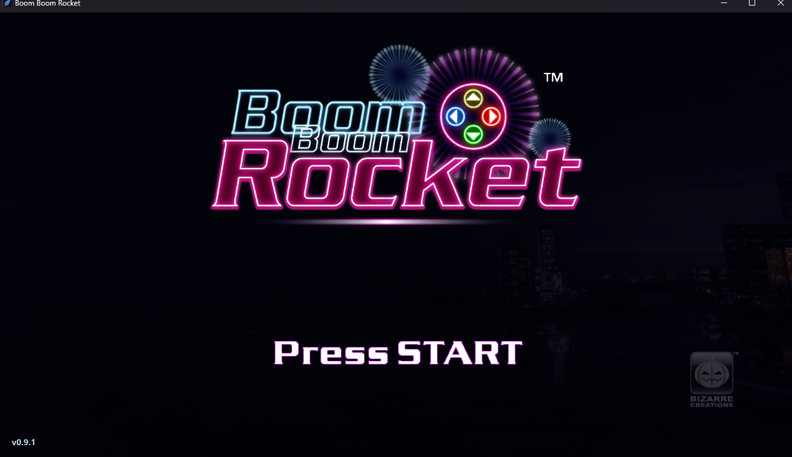
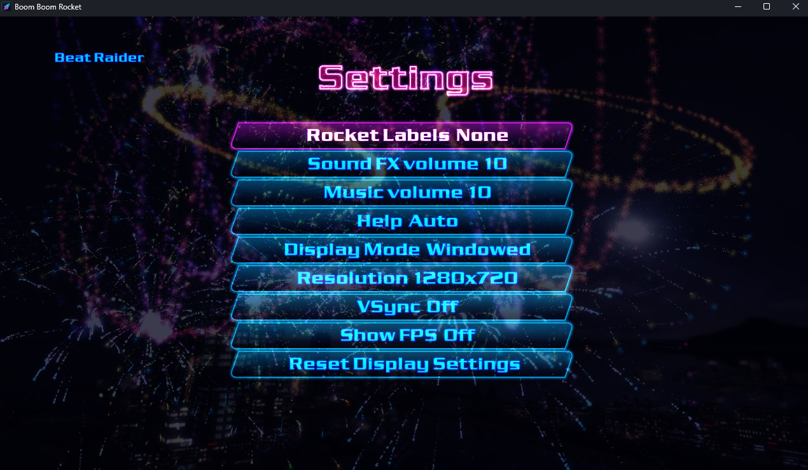

# Boom Boom Rocket XBLA PC Recomp

A native Windows PC recompilation of **Boom Boom Rocket**, the Xbox Live Arcade
rhythm game, using [ReXGlue](https://github.com/rexglue/rexglue-sdk). The original
Xbox 360 program is statically recompiled; this is not a wrapper that launches
Xenia. Current version: **0.9.1**.

> **You need your own legally obtained copy of Boom Boom Rocket.** This project
> contains no original game executable, graphics, sound, music or other game
> data. Setup imports the supported Xbox 360 game package you provide, and the
> optional Boom Boom Rock Pack DLC, into your own portable game folder.

If you enjoy this project, you can support future recomp projects on Ko-fi.
Support is optional, and all projects and releases remain free.

[](https://ko-fi.com/caiuscodes)



## Requirements

- Windows 10 or 11, 64-bit
- An AVX2-capable x86-64-v3 CPU and a Direct3D 12-capable GPU
- .NET Framework 4.8 for setup and the play launcher
- Your own Boom Boom Rocket XBLA package (Title ID `5841086A`)
- Optional: your own **Boom Boom Rock Pack DLC** package

Keyboard and mouse work for player 1. Experimental local multiplayer requires
two Xbox-compatible controllers connected before launch.

## Install and play

1. Download `Boom-Boom-Rocket-XBLA-PC-Recomp-v0.9.1.zip` from
   [Releases](https://github.com/CaiusCodes/Boom-Boom-Rocket-XBLA-PC-Recomp/releases).
2. Extract the whole ZIP into a writable folder, outside Program Files.
3. Run **Setup Boom Boom Rocket.exe** and select your original game package.
   Packages can be extensionless; do not select a ZIP or `default.xex`.
4. Optionally select the **Boom Boom Rock Pack DLC**, then choose **Install game**.
5. Choose **Play now**, or launch `Game/Boom Boom Rocket.exe` afterward.

Before setup, the release root contains only setup, `README.txt` and `licenses/`.
Setup creates `Game/`, containing the play launcher, `resources/` and
`release-manifest.json`. Settings, saves, imported assets, DLC and caches stay
under `Game/resources/`. Move or back up the whole portable folder together.
No administrator access or registry installation is needed.

Run setup again to add DLC later; existing saves and settings are preserved.
Do not redistribute a populated `Game/` folder or your original game packages.

## Features

- Native Windows build using ReXGlue's graphics, audio and Xbox-service runtime
- Single-player modes and experimental local two-player Battle and Endurance
- Keyboard/mouse and Xbox-compatible controller support
- Native menu mouse selection; paced mouse-wheel navigation on song lists
- Windowed/fullscreen mode, resolution, VSync and optional FPS display
- Separate Gamepad Controls, Keyboard Controls and manual Timing Calibration pages
- Portable saves and optional DLC imported from your own files
- Automatic controller/keyboard rocket labels, unless you save a manual choice
- Title-screen version label and distinct setup/game icons



## Controls

| Key / button | Action |
|---|---|
| WASD or arrow keys | Directions / menu navigation |
| Enter or Space | Start / pause |
| Escape | Pause during play; B / back in menus |
| E or left click | A / confirm |
| B, Backspace or right click | B / back |
| X, Y | X and Y buttons |
| Mouse wheel on song lists | Move up/down; left click confirms the highlighted song |

Left click cycles Settings values and wraps through available choices. E/A
saves Settings; right click or Escape goes back. Without a controller the title
screen says *Press Any Key*, and controller-button footer hints are hidden.
Keyboard/mouse supplement player 1 only; local multiplayer needs two controllers.
See the included release `README.txt` for calibration and troubleshooting details.

## Known limitations

- Windows x64 only; local multiplayer is experimental. Real-controller hot-plug,
  timing feel and long two-player sessions still need wider user testing.
- Xbox Live, online multiplayer, system leaderboards, achievement UI and
  Marketplace screens are unavailable.
- The runtime uses one tested executable layout. Setup verifies the extracted
  XEX SHA256, not the container filename or hash:
  `B1BC45589CEC79E375E23FC48C122FA5902A2DFD6E3C9C765064DCD9E1A8709B`.
  Other executable revisions need separate compatibility testing.
- Setup and the game are not digitally signed. Check the release's origin if
  Windows displays a warning. VSync defaults on; saved choices are preserved.

For bug reports, include the newest log from `Game/resources/logs/`, after
checking it for personal installation paths. Do not attach original game files.

## For developers

You need Git, CMake 3.25+, Ninja, Clang 18+, Windows PowerShell, and the Visual
Studio C++ Build Tools with Windows SDK, plus your own game package. Tested with
Clang 22.1.8, CMake 4.4.2, Ninja 1.13.2 and .NET Framework 4.8.

From the project directory:

```powershell
./tools/Get-Sdk.ps1
./tools/Build-Sdk.ps1
./tools/Regenerate.ps1 -GamePackage "PATH_TO_YOUR_ORIGINAL_PACKAGE"
cmake --preset win-amd64-release
cmake --build --preset win-amd64-release --target boom_boom_rocket
./tools/Build-Setup.ps1
```

ReXGlue is fetched into ignored `out/dependencies/rexglue-sdk`, pinned to commit
`3eb9b511b4140d2769e27be63eae57d41bfa2afa` (upstream 0.9.0). The fetch script
verifies required dependency submodule commits. Project changes are deterministic
patches in `patches/sdk.json`; no modified local SDK or root submodule is required.
The SDK installs to `out/sdk-install`.

`Regenerate.ps1` verifies the XEX, generates in private staging and applies
`patches/generated.json`. All 16 generated files are hash-verified; translated
game source is ignored and never edited by hand. The CMake codegen target uses
the same pipeline. Set `BBR_GAME_DIRECTORY` for extracted private input, and do
not run raw codegen over patched output. See [patches/README.md](patches/README.md).

For isolated builds, use new `-BuildDirectory`/`-InstallDirectory` arguments to
`Build-Sdk.ps1`, a new CMake `-B` directory with `-DBBR_SDK_PREFIX=...`, and the
matching regeneration `-SdkPrefix`. The game builds to
`out/build/win-amd64-release/boom_boom_rocket.exe`.

`Make Release.bat` builds and packages setup. Alternatively use
`tools/Package-Portable.ps1 -SetupExe ... -ReleaseDirectory ...` and
`tools/Package-DependencySource.ps1 -Destination ...`. Publish the portable ZIP
and matching dependency-source ZIP together. GitHub's tagged source archive
contains the complete project; a separate project-source ZIP is not needed.
`VERSION` records the release version. Never commit private imports or `out/`.

## Licence and credits

Original project/tooling/integration code is MIT licensed; see [LICENSE](LICENSE).
Original or translated Boom Boom Rocket code and assets are **not** MIT licensed.
ReXGlue, Extract-STFS and other dependencies retain their own licences in
[packaging/licenses](packaging/licenses).

FFmpeg and libmspack are LGPL components in the runtime. The matching
`Boom-Boom-Rocket-XBLA-PC-Recomp-v0.9.1-Dependency-Source.zip` accompanies the
portable ZIP and includes their source and runtime rebuild/relink instructions.
No original game files are needed to rebuild those libraries. Their licences
permit modifications and reverse engineering to debug those modifications.

Boom Boom Rocket, Xbox and Xbox 360 belong to their respective rights holders.
This is an unofficial project, not affiliated with or endorsed by them.
Screenshots are documentation, not installable game assets.
